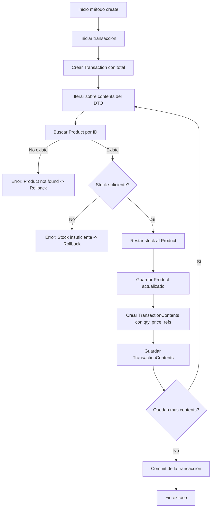

# Apuntes sobre el método `create` con transacciones en TypeORM (NestJS)

Este apunte explica, paso a paso, el funcionamiento del método `create` que utiliza transacciones en TypeORM para asegurar la consistencia de los datos al crear una transacción de compra/venta en un sistema.

---

## Contexto general

En un sistema de gestión de productos y transacciones:

- Cada **Producto** (`Product`) tiene un stock disponible.
- Una **Transacción** (`Transaction`) representa una compra, con un **total** y varios **contenidos** (los productos comprados).
- Cada **Contenido de Transacción** (`TransactionContents`) detalla la relación entre una transacción y un producto (cantidad, precio, etc.).

La función `create` recibe un **DTO (Data Transfer Object)** con el total y los contenidos de la transacción, y debe:

1. Crear una nueva transacción.
2. Validar que los productos existan.
3. Verificar que cada producto tenga suficiente stock.
4. Descontar el stock de cada producto.
5. Crear los registros de `TransactionContents` que unen la transacción con los productos.

Todo esto debe hacerse de forma **atómica**: si falla un paso, ningún cambio debe persistir en la base de datos. Por eso se utiliza una **transacción de base de datos**.

---

## Explicación línea por línea

```ts
async create(createTransactionDto: CreateTransactionDto) {
```

- Definición del método asíncrono `create`, que recibe un DTO con la información de la transacción a registrar.

---

```ts
await this.productRepository.manager.transaction(async (transactionEntityManager) => {
```
- Se inicia una **transacción** con TypeORM usando el `manager` del repositorio de productos.
- `transactionEntityManager` es un **gestor transaccional** que asegura que todas las operaciones dentro de su bloque se ejecuten en la misma transacción de la base de datos.
- Si ocurre un error, se hace **rollback** (se revierten los cambios).

---

```ts
const transaction = new Transaction()
transaction.total = createTransactionDto.total
await transactionEntityManager.save(Transaction, transaction)
```
- Se crea una nueva instancia de `Transaction`.
- Se asigna el `total` recibido en el DTO.
- Se guarda en la base de datos dentro de la transacción.

---

```ts
for (const contents of createTransactionDto.contents) {
```
- Se itera sobre cada contenido de la transacción. Cada elemento representa un producto comprado con su cantidad y precio.

---

```ts
const product = await transactionEntityManager.findOneBy(Product, { id: contents.productId })
```
- Se busca el producto en la base de datos usando el `id` del contenido actual.
- Si el producto no existe, el proceso no puede continuar.

---

```ts
if (!product) {
  throw new NotFoundException(`Product with id ${contents.productId} not found`)
}
```
- Validación: si el producto no existe, se lanza un error.
- Esto aborta la transacción automáticamente, evitando cambios parciales.

---

```ts
if (product.stock < contents.quantity) {
  throw new NotFoundException(`Product with id ${contents.productId} has not enough stock`)
}
```
- Validación: si el stock es insuficiente para cubrir la cantidad pedida, se lanza un error.
- También aborta la transacción completa.

---

```ts
product.stock -= contents.quantity
await transactionEntityManager.save(Product, product)
```
- Se descuenta la cantidad del stock del producto.
- Se guarda la actualización en la base de datos **dentro de la transacción**.

---

```ts
const transactionContent = new TransactionContents()
transactionContent.quantity = contents.quantity
transactionContent.price = contents.price
transactionContent.transaction = transaction
transactionContent.product = product
```
- Se crea una nueva instancia de `TransactionContents`.
- Se asignan los valores correspondientes:
  - `quantity` y `price` desde el DTO.
  - La relación con la `transaction` recién creada.
  - La relación con el `product` actualizado.

---

```ts
await transactionEntityManager.save(transactionContent)
await transactionEntityManager.save(TransactionContents, transactionContent)
```
- Aquí se guarda el contenido de la transacción.
- **Nota:** hay redundancia: se está guardando dos veces el mismo objeto (`transactionEntityManager.save(transactionContent)` y `transactionEntityManager.save(TransactionContents, transactionContent)`). Con una sola basta.

---

## Conclusiones

1. **Uso de transacciones:**  
   Garantiza que todos los pasos se completen o ninguno se aplique (consistencia de datos).

2. **Validaciones críticas:**  
   - Existencia del producto.  
   - Suficiencia de stock.  

3. **Actualización del stock:**  
   Se descuenta y guarda de inmediato dentro de la transacción.

4. **Redundancia en el guardado de contenidos:**  
   Se debería guardar una sola vez cada `TransactionContents`.

---

## Diagrama de flujo (Mermaid)



---

## Mejora sugerida

```ts
await transactionEntityManager.save(transactionContent)
```

La segunda llamada a `save` no es necesaria.

